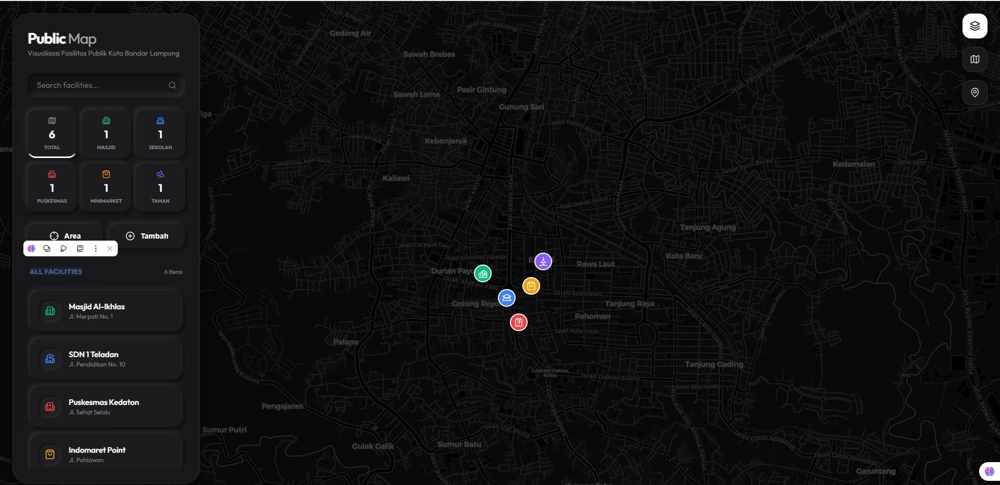
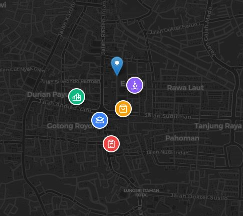
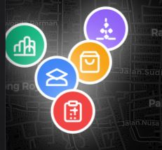
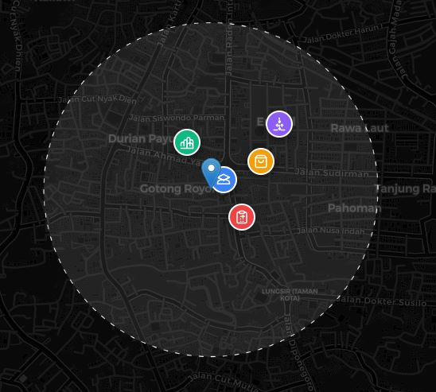
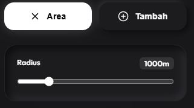

# LAPORAN PRAKTIKUM SISTEM INFORMASI GEOGRAFIS
## PERTEMUAN 8: MEMBANGUN APLIKASI WEB-GIS FRONTEND DENGAN REACT DAN LEAFLET

**Nama:** Febrian Valentino Nugroho  
**NIM:** 123140034  
**Mata Kuliah:** Praktikum SIG

---

### 1. TUJUAN PRAKTIKUM
1. Memahami konsep integrasi antara REST API Spasial (FastAPI + PostGIS) dengan aplikasi Frontend.
2. Membangun antarmuka peta interaktif menggunakan library Leaflet dan React-Leaflet.
3. Mengimplementasikan visualisasi data GeoJSON dengan kategorisasi simbol (styling kustom).
4. Membangun fitur interaksi spasial kompleks seperti Nearby Search (pencarian radius) dan Map Center handling.
5. Mengimplementasikan fitur manajemen data (Create) secara visual menggunakan interaksi klik pada peta.
6. Menerapkan desain antarmuka modern (Neumorphism & iOS-Style) untuk meningkatkan aspek usability aplikasi.

### 2. PERALATAN DAN BAHAN (TECH STACK)
- **React.js:** Framework JavaScript untuk membangun antarmuka web yang reaktif.
- **Vite:** Build tool modern untuk pengembangan aplikasi React yang cepat.
- **Leaflet.js:** Library open-source utama untuk integrasi peta interaktif.
- **React-Leaflet:** Wrapper React untuk Leaflet guna mempermudah manajemen state peta.
- **Axios:** Library untuk menangani permintaan HTTP asinkron ke backend API.
- **Lucide-React:** Library ikon untuk elemen antarmuka.
- **CSS Vanilla:** Digunakan untuk kustomisasi desain Neumorphism dan Glassmorphism.

### 3. LANGKAH-LANGKAH IMPLEMENTASI
#### 3.1 Inisialisasi Project & Konfigurasi API
Melakukan setup project React menggunakan Vite dan mengatur konfigurasi `constants.js` untuk menghubungkan frontend ke BASE_URL backend FastAPI (`http://localhost:8000`).

#### 3.2 Pengembangan Antarmuka (UI/UX)
Membangun sidebar melayang (Floating Sidebar) dengan Mengimplementasikan Grid Statistik untuk menampilkan jumlah data tiap kategori secara real-time dan menambahkan Basemap Switcher (Dark, Street, Satellite).

#### 3.3 Integrasi Data Spasial & Interaction
Menggunakan hook `useEffect` untuk melakukan fetch data GeoJSON. Implementasi fungsi `pointToLayer` untuk memberikan ikon dan warna berbeda berdasarkan kategori (Masjid, Sekolah, Puskesmas, dll) serta efek 'Pulse/Ping' pada marker via CSS Animation.

#### 3.4 Implementasi Fitur Nearby & Tambah Data
Menambahkan slider untuk radius dan menggunakan `useMapEvents` untuk menangkap koordinat klik pada peta guna mengirim data ke endpoint `/nearby` atau mengisi form "Tambah Data" secara otomatis.

---

### 4. HASIL PRAKTIKUM

#### 4.1 Tampilan Dokumentasi Web-GIS

*Keterangan: Tampilan utama aplikasi Web-GIS yang berjalan di localhost:3000.*

#### 4.2 Hasil Uji Coba Deskriptif & Interaksi

*Keterangan: Sidebar Neumorphic dengan grid statistik simetris.*

*Keterangan: Menunjukkan feedback visual saat marker didekati dan informasi popup yang muncul saat diklik.*

#### 4.3 Hasil Uji Coba Spasial (Nearby Search)

*Keterangan: Lingkaran (Circle) berwarna indigo muncul pada titik klik menunjukkan area radius pencarian fasilitas terdekat.*

---

### 5. ANALISIS
1. **Integrasi Client-Server:** Penggunaan format GeoJSON sangat efisien karena format ini didukung secara native oleh Leaflet, memungkinkan manipulasi data di sisi client (filtering kategori) berjalan sangat cepat tanpa beban server berlebih.
2. **User Experience (UX):** Fitur seperti animasi pulse dan transisi flyTo sangat membantu orientasi pengguna. Desain Neumorphism memberikan kesan modern dan bersih sehingga informasi spasial menjadi fokus utama.
3. **Visual Hierarchy:** Pembagian statistik ke dalam grid simetris memudahkan pengguna memahami distribusi fasilitas tanpa harus membaca tabel data yang panjang.

### 6. KESIMPULAN
Praktikum Pertemuan 8 berhasil membuktikan bahwa integrasi antara Backend Spasial (FastAPI/PostGIS) dan Frontend (React/Leaflet) dapat menghasilkan aplikasi Web-GIS yang fungsional dan profesional. Seluruh kriteria tugas, mulai dari visualisasi GeoJSON hingga fitur interaksi spasial kompleks, telah berhasil diimplementasikan dengan baik.
