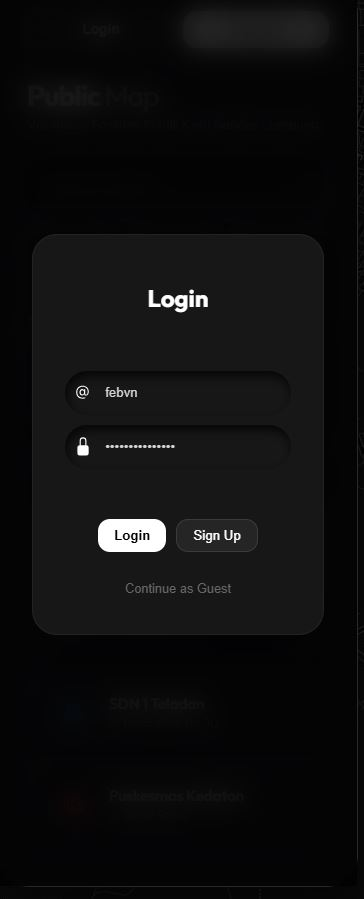
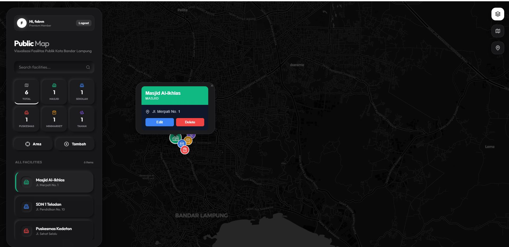

# WebGIS Fasilitas Publik - Tugas Praktikum 9

## PERTEMUAN 9: PENGEMBANGAN FULL-STACK WEBGIS DENGAN AUTENTIKASI JWT DAN MANAJEMEN CRUD SPASIAL

**Nama**: Febrian Valentino Nugroho  
**NIM**: 123140034  
**Mata Kuliah**: Praktikum SIG

---

## 📁 Submission Links
- **GitHub Repository**: [https://github.com/Febvn/SIG_9](https://github.com/Febvn/SIG_9)
- **Laporan PDF**: [Praktikum9_SIG_123140034.pdf](assets/Praktikum9_SIG_123140034.pdf)

---

## 1. TUJUAN PRAKTIKUM
1. Membangun sistem keamanan pada WebGIS menggunakan protokol JSON Web Token (JWT).
2. Mengimplementasikan siklus CRUD (Create, Read, Update, Delete) secara lengkap pada database PostGIS.
3. Mengintegrasikan interaksi peta (Leaflet) dengan form manajemen data (React) secara reaktif.
4. Menerapkan validasi data tingkat lanjut menggunakan Pydantic di sisi backend dan Constraint Validation di sisi frontend.
5. Memahami konsep Protected Routes untuk membatasi akses fitur administratif hanya kepada pengguna terautentikasi.

## 2. ARSITEKTUR SISTEM & TECH STACK
- **Backend**: FastAPI (Python) dengan library JOSE untuk JWT dan Passlib untuk hashing password.
- **Database**: PostGIS (PostgreSQL) untuk penyimpanan data tabular dan geometri.
- **Frontend**: React.js dengan Vite, Leaflet sebagai mesin peta, dan Axios untuk komunikasi API.
- **Keamanan**: Implementasi Bearer Token Authentication dan enkripsi Bcrypt pada penyimpanan kredensial.

## 3. LANGKAH-LANGKAH IMPLEMENTASI
### 3.1 Implementasi Autentikasi (JWT)
Backend menyediakan dua endpoint utama: `/auth/register` dan `/auth/login`. Saat login berhasil, server mengirimkan access token yang akan disimpan di localStorage frontend. Token ini kemudian dilampirkan pada header Authorization setiap kali pengguna melakukan operasi tambah, edit, atau hapus data.

### 3.2 Manajemen CRUD & Interaksi Spasial
- **Create**: Penambahan data fasilitas dilakukan melalui klik pada peta untuk mendapatkan koordinat otomatis (Map-to-Form Sync).
- **Read**: Data ditarik dalam format GeoJSON menggunakan query `ST_AsGeoJSON` yang dioptimalkan.
- **Update**: Fitur Live Editing yang memungkinkan pengguna mengubah informasi atau menggeser lokasi fasilitas melalui popup marker.
- **Delete**: Penghapusan data secara seamless yang memicu state update pada peta tanpa perlu memuat ulang halaman (Single Page Application behavior).

### 3.3 Optimasi Query & UI/UX
Penggunaan Casting `::geography` pada query radius (`ST_DWithin`) untuk memastikan akurasi jarak dalam satuan meter. Sisi UI dipoles menggunakan desain Neumorphism dan Glassmorphism dengan sistem notifikasi toast kustom.

---

## 4. HASIL DAN PENGUJIAN (DOKUMENTASI)

### 4.1 Antarmuka Autentikasi (Login & Register)

### 4.2 Manajemen Data pada Marker (Edit & Delete)

*Keterangan: Bukti implementasi CRUD lengkap yang dapat diakses langsung melalui interaksi pada peta.*

### 4.3 Form Edit dengan Validasi Frontend

*Keterangan: Form yang menampilkan koordinat otomatis hasil klik peta serta validasi input Pydantic.*

---

## 5. ANALISIS
1. **Keamanan Berlapis**: Dengan JWT, operasi modifikasi data terlindungi dari akses ilegal. Enkripsi password dengan Bcrypt memastikan privasi pengguna terjaga di level database.
2. **Efisiensi Alur Kerja**: Sinkronisasi antara peta dan form (Map-Form Sync) sangat mengurangi risiko kesalahan input koordinat manual oleh pengguna.
3. **Skalabilitas**: Pemisahan antara backend (FastAPI) dan frontend (React) memungkinkan aplikasi ini dikembangkan lebih lanjut menjadi platform kolaboratif berskala luas.

## 6. KESIMPULAN
Praktikum Pertemuan 9 berhasil mengintegrasikan aspek keamanan dan manajemen data yang kompleks ke dalam sebuah ekosistem WebGIS. Seluruh ketentuan tugas, mulai dari sistem login JWT hingga fitur CRUD spasial yang interaktif, telah berhasil diimplementasikan dan diuji dengan baik.

---

## 🚀 Cara Setup (GitHub Submission)
1. **Clone & Install**:
   - Frontend: `cd frontend && npm install`
   - Backend: `pip install -r requirements.txt`
2. **Environment**:
   Buat file `.env` berisi `DATABASE_URL` dan `SECRET_KEY`.
3. **Database**:
   Pastikan ekstensi PostGIS aktif dan jalankan `python init_db.py`.
4. **Running**:
   - Backend: `uvicorn main:app --reload`
   - Frontend: `npm run dev`
